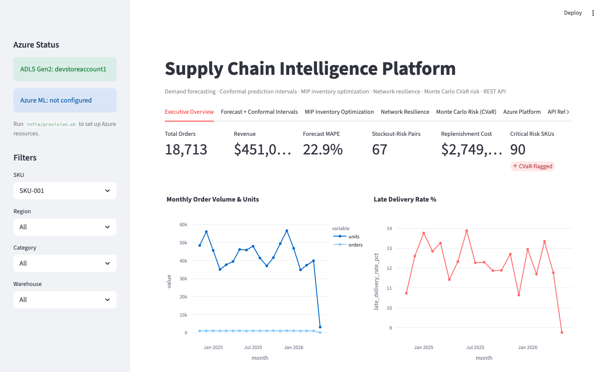
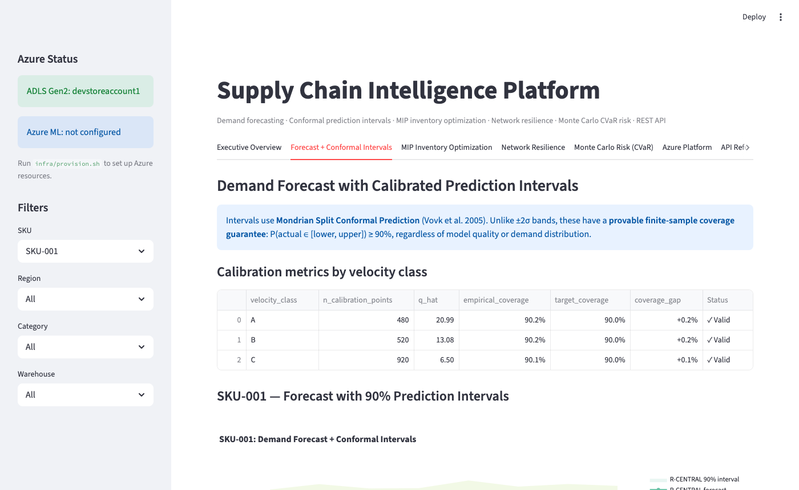
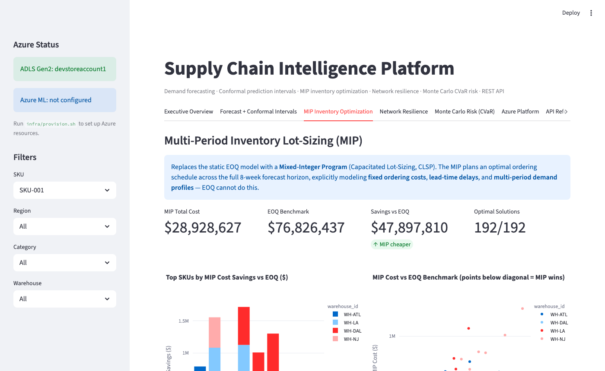
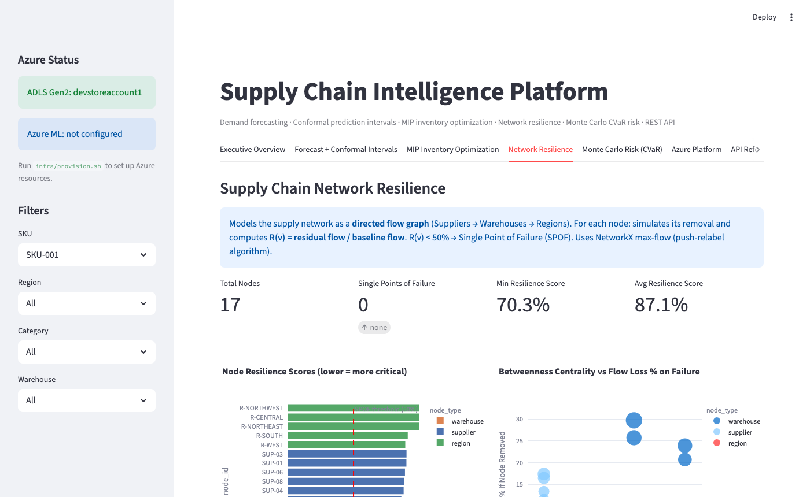
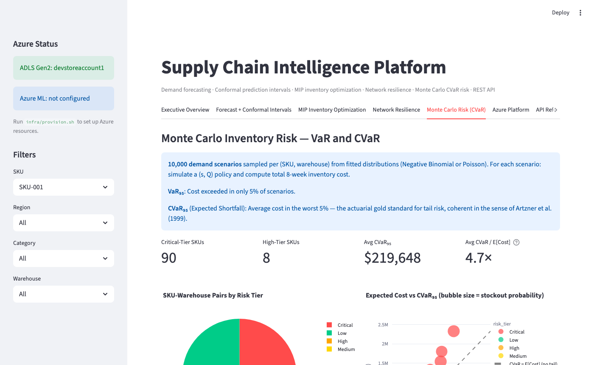
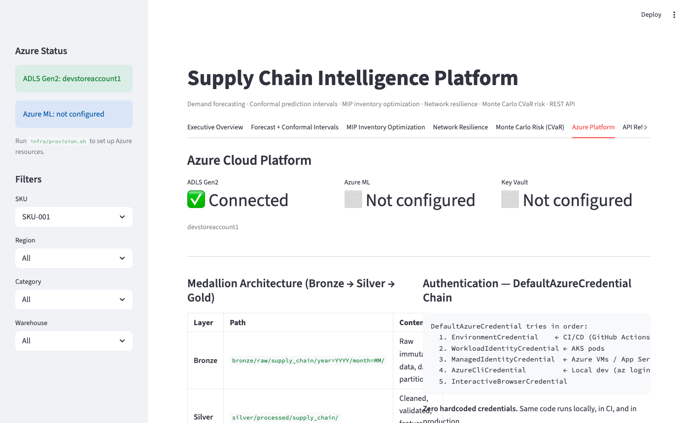

# Supply Chain Intelligence Platform

[](https://python.org)
[](https://azure.microsoft.com)
[](https://mlflow.org)
[](https://fastapi.tiangolo.com)
[](https://streamlit.io)
[](LICENSE)

An end-to-end supply chain intelligence platform combining **provably calibrated forecasting**, **multi-period lot-sizing MIP**, **graph-theoretic network resilience**, and **Monte Carlo CVaR risk analysis** — deployed on **Azure Data Lake Storage Gen2** with **MLflow experiment tracking** and a **FastAPI REST layer**.

> Built for senior data engineers who want to see production-quality, research-backed supply chain analytics — not just a demand forecast and a bar chart.

---

## Screenshots

### Executive Overview


### Conformal Forecast Intervals


### MIP Order Schedule


### Network Resilience Analysis


### CVaR Risk Dashboard


### Azure Platform Integration


---

## Architecture

```
┌─────────────────────────────────────────────────────────────────────┐
│                     DATA LAYER (Azure ADLS Gen2)                    │
│  ┌──────────────┐  ┌──────────────┐  ┌──────────────────────────┐  │
│  │    BRONZE    │  │    SILVER    │  │          GOLD            │  │
│  │  Raw Ingress │→ │  Cleaned &   │→ │  Aggregated KPIs &       │  │
│  │  Hive-part.  │  │  Validated   │  │  Business-Ready Outputs  │  │
│  └──────────────┘  └──────────────┘  └──────────────────────────┘  │
└─────────────────────────────────────────────────────────────────────┘
                              ↓
┌─────────────────────────────────────────────────────────────────────┐
│                     INTELLIGENCE LAYER                              │
│  ┌─────────────────────┐  ┌──────────────────────────────────────┐ │
│  │  Conformal Forecast │  │  Multi-Period Lot-Sizing MIP         │ │
│  │  Mondrian Split CP  │  │  PuLP/CBC — 192 SKU-WH pairs         │ │
│  │  P(Y∈Ĉ(X)) ≥ 1-α   │  │  Fixed cost + lead-time delays       │ │
│  └─────────────────────┘  └──────────────────────────────────────┘ │
│  ┌─────────────────────┐  ┌──────────────────────────────────────┐ │
│  │  Graph Resilience   │  │  Monte Carlo CVaR                    │ │
│  │  NetworkX Max-Flow  │  │  10k scenarios, Neg-Binomial/Poisson │ │
│  │  R(v) = F(G-v)/F(G) │  │  VaR₉₅, CVaR₉₅, Expected Shortfall │ │
│  └─────────────────────┘  └──────────────────────────────────────┘ │
└─────────────────────────────────────────────────────────────────────┘
                              ↓
┌─────────────────────────────────────────────────────────────────────┐
│                      SERVING LAYER                                  │
│     FastAPI REST API          Streamlit Dashboard (7 tabs)          │
│     10 typed endpoints        Executive · Forecast · MIP ·          │
│     Pydantic v2 models        Resilience · Risk · Azure · API       │
└─────────────────────────────────────────────────────────────────────┘
                              ↓
┌─────────────────────────────────────────────────────────────────────┐
│                       MLOPS LAYER                                   │
│     MLflow Experiment Tracking    Azure ML Model Registry           │
│     Hyperparams · Metrics ·       Staging → Production              │
│     Artifacts · Model Versions    DefaultAzureCredential chain      │
└─────────────────────────────────────────────────────────────────────┘
```

---

## Technical Features

### 1. Mondrian Split Conformal Prediction

Standard forecasting gives point estimates. This implementation provides **provably calibrated prediction intervals** using split conformal prediction (Vovk et al., 2005):

```
P(Y_{n+1} ∈ Ĉ(X_{n+1})) ≥ 1 − α
```

- **Mondrian stratification** by velocity class (A/B/C) — separate quantile calibration per class prevents high-volume SKUs from dominating interval width
- Nonconformity scores: `s_i = |ŷ_i − y_i|` on a held-out calibration set
- Interval: `[ŷ − q̂_{1−α}, ŷ + q̂_{1−α}]` where `q̂` is the `⌈(n+1)(1−α)⌉/n` empirical quantile
- **No distributional assumptions** — valid coverage regardless of forecast model or demand distribution
- Output: `forecast_intervals.csv` with lower/upper bounds + `conformal_calibration_metrics.csv` with empirical coverage per class

### 2. Multi-Period Lot-Sizing MIP (CLSP)

A **Capacitated Lot-Sizing Problem** solved via integer programming for each SKU-warehouse pair across the 8-week forecast horizon:

```
min  Σ_t [ K·z_t  +  c·q_t  +  h·I_t  +  p·B_t ]

s.t. I_t = I_{t-1} + q_{t-L} − d_t + B_t      ∀t  (inventory balance + backlog)
     q_t ≤ M·z_t                                ∀t  (linking: order only if z_t=1)
     I_t, B_t, q_t ≥ 0;  z_t ∈ {0,1}
```

Where `K` = fixed order cost, `c` = unit cost, `h` = holding cost rate, `p` = backlog penalty, `L` = supplier lead time in weeks, `M` = big-M constant.

- Solves **192 MIPs** (48 SKUs × 4 warehouses) using PuLP with CBC solver
- Benchmarks against classical EOQ — MIP average cost vs EOQ benchmark per SKU
- Output: `mip_order_schedule.csv` (week-by-week orders) + `mip_inventory_summary.csv`

### 3. Supply Chain Graph Resilience (NetworkX)

Models the supply network as a directed graph `G = (V, E)` and quantifies **single-point-of-failure risk** using max-flow:

```
R(v) = MaxFlow(G − {v}) / MaxFlow(G)
```

- **Nodes**: Suppliers (source layer) → Warehouses (middle layer) → Regions (sink layer)
- **Edge capacities**: supplier→warehouse from historical order volume; warehouse→region from weekly capacity
- Betweenness centrality identifies structurally critical nodes
- `R(v) < 0.5` → flagged as **Single Point of Failure (SPOF)**
- Push-relabel max-flow algorithm (Goldberg & Tarjan, 1988)
- Output: `resilience_scores.csv`, `network_edges.csv`, `network_redundancy.csv`

### 4. Monte Carlo CVaR Risk Engine

**Coherent risk measure** (Artzner et al., 1999) computed via simulation for each SKU-warehouse pair:

```
CVaR_α = E[Loss | Loss ≥ VaR_α]   (Expected Shortfall above α-quantile)
```

- **10,000 demand scenarios** per pair using fitted Negative Binomial (overdispersed) or Poisson distribution
- Simulates `(s, Q)` reorder-point policy across `T` periods per scenario — tracks holding costs, stockout penalties, order costs
- Computes: `VaR₉₅`, `CVaR₉₅`, `cvar_to_mean_ratio`, `stockout_probability`
- Risk tier classification: **Critical** (CVaR/mean > 3) · **High** · **Medium** · **Low**
- Output: `risk_metrics.csv`

### 5. Azure Data Lake Gen2 Medallion Architecture

Production-grade cloud storage with **Hierarchical Namespace** (HNS) for true directory semantics:

```
supply-chain/
├── bronze/    ← raw ingestion, Hive-style date partitions (year=YYYY/month=MM)
├── silver/    ← cleaned & validated pipeline outputs
└── gold/      ← aggregated KPIs and PowerBI-ready tables
```

- **`DefaultAzureCredential` chain**: `az login` → Service Principal env vars → Managed Identity (zero hardcoded credentials)
- Local dev with **Azurite emulator** — identical code path, `AZURE_USE_EMULATOR=true` in `.env`
- `infra/provision.sh`: full Azure CLI IaC (resource group, ADLS Gen2, Key Vault, Azure ML workspace, RBAC assignments)

### 6. MLflow Experiment Tracking + Azure ML Model Registry

```python
with tracker.start_run("pipeline_run"):
    tracker.log_params({"n_skus": 48, "forecast_horizon": 8, ...})
    tracker.log_metrics({"mape": 12.4, "coverage_90": 0.91, ...})
    tracker.log_model(rf_model, "random_forest_demand")
    tracker.promote_model_to_staging("random_forest_demand")
```

- Logs hyperparameters, accuracy metrics, feature importances, conformal calibration stats, MIP solve times, CVaR summaries
- In Azure mode: registers model to **Azure ML Model Registry** and transitions lifecycle (None → Staging → Production)

---

## Quickstart

### Local (no Azure required)

```bash
git clone https://github.com/adithyasa47/supply-chain-intelligence.git
cd supply-chain-intelligence

python3 -m venv .venv && source .venv/bin/activate
pip install -r requirements.txt

python run_pipeline.py          # runs all 10 pipeline steps
streamlit run app.py            # opens dashboard at localhost:8501
```

### With Azurite (Azure emulator, local)

```bash
# Install Azurite
npm install -g azurite --prefix ~/.local
~/.local/bin/azurite --silent &

# Set emulator flag
echo "AZURE_USE_EMULATOR=true" > .env
echo "AZURE_STORAGE_FILESYSTEM=supply-chain" >> .env

python run_pipeline.py --azure   # uploads to Azurite + logs to MLflow
```

### With Real Azure

```bash
# Provision infrastructure
bash infra/provision.sh

# Copy printed env vars into .env, then:
az login
python run_pipeline.py --azure
```

### REST API

```bash
uvicorn api.main:app --reload
# Docs at http://localhost:8000/docs
```

---

## REST API Endpoints

| Method | Endpoint | Description |
|--------|----------|-------------|
| GET | `/health` | Pipeline status + Azure connectivity |
| GET | `/forecast/{sku_id}` | Conformal intervals for a SKU |
| GET | `/forecast/{sku_id}/interval` | Summary stats for forecast band |
| GET | `/inventory/recommendations` | All inventory optimization recs |
| GET | `/inventory/mip/{sku_id}` | MIP order schedule for a SKU |
| GET | `/resilience/scores` | All node resilience scores |
| GET | `/resilience/spof` | Single-points-of-failure only |
| GET | `/risk/{sku_id}/{warehouse_id}` | CVaR risk profile for a pair |
| GET | `/risk/critical` | All Critical-tier risk pairs |
| GET | `/network/allocation` | Network optimization allocations |

Full interactive docs: `http://localhost:8000/docs`

---

## Pipeline Steps

```
Step  1 — Generate synthetic supply chain data
Step  2 — Load raw data into SQLite
Step  3 — Random Forest demand forecasting
Step  4 — Inventory optimization (safety stock, ROP, EOQ)
Step  5 — Warehouse network allocation (greedy, capacity-aware)
Step  6 — Scenario simulation (5 disruption scenarios)
Step  7 — SQL reporting & KPI computation
Step  8 — Conformal prediction intervals (Mondrian split CP)
Step  9 — Multi-period lot-sizing MIP (CLSP, 192 pairs)
Step 10 — Supply chain graph resilience (NetworkX max-flow)
Step 11 — Monte Carlo CVaR risk engine (10k scenarios/pair)
─────── Azure steps (--azure flag) ───────────────────────
Step 12 — Upload all outputs to ADLS Gen2 medallion layers
Step 13 — Log experiment to MLflow / Azure ML Model Registry
```

---

## Pipeline Outputs

| File | Description |
|------|-------------|
| `data/processed/forecast_output.csv` | SKU-region-week forecasts |
| `data/processed/forecast_intervals.csv` | Conformal prediction bands (lower/upper) |
| `data/processed/conformal_calibration_metrics.csv` | Empirical coverage per velocity class |
| `data/processed/inventory_recommendations.csv` | Safety stock, ROP, EOQ, stockout risk |
| `data/processed/mip_order_schedule.csv` | Week-by-week MIP optimal orders |
| `data/processed/mip_inventory_summary.csv` | MIP solve stats vs EOQ benchmark |
| `data/processed/resilience_scores.csv` | Node R(v) scores, SPOF flags |
| `data/processed/network_edges.csv` | Graph edges with capacity/flow |
| `data/processed/risk_metrics.csv` | VaR₉₅, CVaR₉₅, risk tier per pair |
| `data/powerbi_outputs/*.csv` | 9 Power BI-ready aggregated tables |
| `supply_chain_control_tower.db` | SQLite database with full schema + views |

---

## Project Structure

```
supply-chain-intelligence/
├── app.py                          # Streamlit dashboard (7 tabs)
├── run_pipeline.py                 # Orchestrator (--azure, --skip-data-gen)
├── config.json                     # Project parameters
├── requirements.txt
│
├── src/
│   ├── generate_data.py            # Synthetic data generation
│   ├── database.py                 # SQLite schema + ingestion
│   ├── forecasting.py              # Random Forest demand forecast
│   ├── conformal_forecasting.py    # Mondrian split conformal prediction ★
│   ├── inventory_optimization.py   # Safety stock, ROP, EOQ
│   ├── stochastic_optimizer.py     # Multi-period lot-sizing MIP ★
│   ├── network_optimization.py     # Greedy warehouse allocation
│   ├── resilience.py               # NetworkX graph resilience ★
│   ├── risk_engine.py              # Monte Carlo CVaR engine ★
│   ├── scenario_simulation.py      # Disruption scenario analysis
│   ├── reporting.py                # KPI aggregation + Power BI outputs
│   └── utils.py
│
├── api/
│   └── main.py                     # FastAPI REST API (10 endpoints) ★
│
├── cloud/
│   ├── config.py                   # AzureConfig (emulator/cloud/local)
│   ├── storage.py                  # ADLS Gen2 medallion upload
│   └── ml_tracking.py              # MLflow + Azure ML Model Registry ★
│
├── infra/
│   └── provision.sh                # Azure CLI IaC provisioning script
│
├── sql/
│   ├── schema.sql
│   ├── views.sql
│   ├── processed_views.sql
│   └── kpi_queries.sql
│
└── docs/
    ├── screenshots/                # Dashboard screenshots
    └── *.md                        # Architecture, deployment, resume docs
```

★ = advanced components not typically found in portfolio projects

---

## Tech Stack

| Layer | Technology |
|-------|-----------|
| Forecasting | Scikit-learn Random Forest, Pandas, NumPy |
| Conformal Prediction | Custom split CP (Mondrian) — scipy for quantiles |
| Optimization | PuLP + CBC MIP solver |
| Graph Analytics | NetworkX (directed graph, max-flow, betweenness) |
| Risk Modeling | NumPy Monte Carlo, SciPy distribution fitting |
| Cloud Storage | Azure Data Lake Storage Gen2 (azure-storage-blob) |
| Auth | azure-identity DefaultAzureCredential |
| ML Tracking | MLflow + Azure ML Model Registry |
| REST API | FastAPI + Pydantic v2 + Uvicorn |
| Dashboard | Streamlit |
| Database | SQLite (Azure SQL-ready schema) |
| Local Azure Emulator | Azurite v3 |
| IaC | Azure CLI (bash) |

---

## Environment Variables

Copy `.env.example` to `.env` and fill in:

```env
# Local emulator (default)
AZURE_USE_EMULATOR=true
AZURE_STORAGE_FILESYSTEM=supply-chain

# Real Azure (production)
# AZURE_STORAGE_ACCOUNT=your-storage-account
# AZURE_STORAGE_FILESYSTEM=supply-chain
# AZURE_TENANT_ID=...
# AZURE_CLIENT_ID=...
# AZURE_CLIENT_SECRET=...
# AZURE_ML_SUBSCRIPTION_ID=...
# AZURE_ML_RESOURCE_GROUP=...
# AZURE_ML_WORKSPACE=...
```

---

## Academic References

1. Vovk, V., Gammerman, A., & Shafer, G. (2005). *Algorithmic Learning in a Random World*. Springer. — Split conformal prediction
2. Artzner, P., Delbaen, F., Eber, J.-M., & Heath, D. (1999). Coherent Measures of Risk. *Mathematical Finance*, 9(3), 203–228. — CVaR/Expected Shortfall
3. Goldberg, A. V., & Tarjan, R. E. (1988). A new approach to the maximum-flow problem. *JACM*, 35(4), 921–940. — Push-relabel max-flow
4. Pochet, Y., & Wolsey, L. A. (2006). *Production Planning by Mixed Integer Programming*. Springer. — Capacitated Lot-Sizing Problem

---

## Resume Bullets

**Title**: Senior Data Engineer / Supply Chain Analytics Engineer

- Engineered a supply chain intelligence platform with **Mondrian split conformal prediction** (Vovk et al. 2005) providing provably calibrated 90% forecast intervals (P(Y∈Ĉ(X))≥1−α) stratified by velocity class, validated empirically on held-out calibration sets
- Implemented a **Capacitated Lot-Sizing MIP** (CLSP) using PuLP/CBC solving 192 SKU-warehouse pairs across an 8-week horizon with fixed ordering costs, lead-time delays, and backlog penalties — benchmarked against EOQ baseline
- Built a **NetworkX graph resilience engine** modeling supplier→warehouse→region as a directed capacity graph; computed node criticality via max-flow perturbation R(v)=F(G-{v})/F(G) to automatically detect single points of failure
- Developed a **Monte Carlo CVaR risk engine** (10,000 scenarios per pair) fitting Negative Binomial/Poisson demand distributions and simulating (s,Q) reorder policies to compute VaR₉₅ and Expected Shortfall (Artzner et al. 1999)
- Designed an **Azure ADLS Gen2 medallion architecture** (Bronze/Silver/Gold) with Hive-style date partitioning, DefaultAzureCredential auth chain, and MLflow experiment tracking integrated with Azure ML Model Registry
- Exposed analytics via a **FastAPI REST API** (10 typed endpoints, Pydantic v2) backed by a 7-tab Streamlit dashboard; local dev replicated full Azure stack using Azurite emulator with zero code changes

---

*Synthetic data — real algorithms. Built to demonstrate production-quality supply chain analytics.*
